Problem Set \#3: Hodgepodge
================
MACS 30200 - Perspectives on Computational Research
**Due Monday May 15th at 11:30am**

-   [Regression diagnostics](#regression-diagnostics)
    -   [1. Test the model to identify any unusual and/or influential observations. Identify how you would treat these observations moving forward with this research. Note you do not actually have to estimate a new model, just explain what you would do. This could include things like dropping observations, respecifying the model, or collecting additional variables to control for this influential effect.](#test-the-model-to-identify-any-unusual-andor-influential-observations.-identify-how-you-would-treat-these-observations-moving-forward-with-this-research.-note-you-do-not-actually-have-to-estimate-a-new-model-just-explain-what-you-would-do.-this-could-include-things-like-dropping-observations-respecifying-the-model-or-collecting-additional-variables-to-control-for-this-influential-effect.)
    -   [2. Test for non-normally distributed errors. If they are not normally distributed, propose how to correct for them.](#test-for-non-normally-distributed-errors.-if-they-are-not-normally-distributed-propose-how-to-correct-for-them.)
    -   [3. Test for heteroscedasticity in the model. If present, explain what impact this could have on inference.](#test-for-heteroscedasticity-in-the-model.-if-present-explain-what-impact-this-could-have-on-inference.)
    -   [4. Test for multicollinearity. If present, propose if/how to solve the problem.](#test-for-multicollinearity.-if-present-propose-ifhow-to-solve-the-problem.)
-   [Interaction terms](#interaction-terms)
    -   [1. Evaluate the marginal effect of age on Joe Biden thermometer rating, conditional on education. Consider the magnitude and direction of the marginal effect, as well as its statistical significance.](#evaluate-the-marginal-effect-of-age-on-joe-biden-thermometer-rating-conditional-on-education.-consider-the-magnitude-and-direction-of-the-marginal-effect-as-well-as-its-statistical-significance.)
    -   [2. Evaluate the marginal effect of education on Joe Biden thermometer rating, conditional on age. Consider the magnitude and direction of the marginal effect, as well as its statistical significance.](#evaluate-the-marginal-effect-of-education-on-joe-biden-thermometer-rating-conditional-on-age.-consider-the-magnitude-and-direction-of-the-marginal-effect-as-well-as-its-statistical-significance.)
-   [Missing data](#missing-data)
    -   [This time, use multiple imputation to account for the missingness in the data. Consider the multivariate normality assumption and transform any variables as you see fit for the imputation stage. Calculate appropriate estimates of the parameters and the standard errors and explain how the results differ from the original, non-imputed model.](#this-time-use-multiple-imputation-to-account-for-the-missingness-in-the-data.-consider-the-multivariate-normality-assumption-and-transform-any-variables-as-you-see-fit-for-the-imputation-stage.-calculate-appropriate-estimates-of-the-parameters-and-the-standard-errors-and-explain-how-the-results-differ-from-the-original-non-imputed-model.)

Regression diagnostics
----------------------

#### 1. Test the model to identify any unusual and/or influential observations. Identify how you would treat these observations moving forward with this research. Note you do not actually have to estimate a new model, just explain what you would do. This could include things like dropping observations, respecifying the model, or collecting additional variables to control for this influential effect.

*Biden Warmth* = *β*<sub>0</sub> + *β*<sub>1</sub>*Age* + *β*<sub>2</sub>*Gender* + *β*<sub>3</sub>*Education*

In this model, *Gender* is 0 when the respondent is a male.The parameters and standard errors of this model has been shown in the following table. The result indicates that gender and education have strong association with the warmth toward Biden (*p*&lt;0.005). If the respondent is female, the warmth toward Biden will be higher by averagely 6.196 than the male respondents with all the other varaibles fixed. However, as one year increases in education, the score of warmth toward Biden will be slightly decreased by a factor of 0.889 on avarage, with other conditions invaraint.In addition, three plots for the warmth toward Biden versus gender, age and eudcation were illustrated below.

``` r
# If you have any problems with the directory setting to load data, please try the following code:
#dir=getwd()
#dir_new = paste(dir, "/ProblemSets/PS3", sep = "")
#setwd(dir_new)

biden <- read_csv("data/biden.csv")
df <-na.omit(biden) %>%
  mutate (gender = ifelse (female == 0, "male", "female"))
biden_mod <- lm(biden ~ age + gender + educ, data = df)
pander(tidy(biden_mod))
```

<table style="width:78%;">
<colgroup>
<col width="16%" />
<col width="15%" />
<col width="16%" />
<col width="16%" />
<col width="12%" />
</colgroup>
<thead>
<tr class="header">
<th align="center">term</th>
<th align="center">estimate</th>
<th align="center">std.error</th>
<th align="center">statistic</th>
<th align="center">p.value</th>
</tr>
</thead>
<tbody>
<tr class="odd">
<td align="center">(Intercept)</td>
<td align="center">74.82</td>
<td align="center">3.614</td>
<td align="center">20.7</td>
<td align="center">1.338e-85</td>
</tr>
<tr class="even">
<td align="center">age</td>
<td align="center">0.04188</td>
<td align="center">0.03249</td>
<td align="center">1.289</td>
<td align="center">0.1975</td>
</tr>
<tr class="odd">
<td align="center">gendermale</td>
<td align="center">-6.196</td>
<td align="center">1.097</td>
<td align="center">-5.65</td>
<td align="center">1.864e-08</td>
</tr>
<tr class="even">
<td align="center">educ</td>
<td align="center">-0.8887</td>
<td align="center">0.2247</td>
<td align="center">-3.955</td>
<td align="center">7.941e-05</td>
</tr>
</tbody>
</table>

``` r
ggplot(df, aes(gender, biden)) +
  geom_boxplot() +
  labs(x = "gender",
       y = "Warmth toward Biden",
       title = "Warmth toward Biden by gender")
```

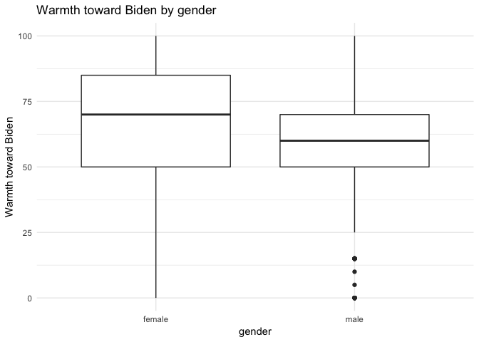

``` r
ggplot(df, aes(age, biden)) +
  geom_point(alpha=0.2, color = "red") +
  labs(x = "age",
       y = "Warmth toward Biden",
       title = "Warmth toward Biden by age")
```

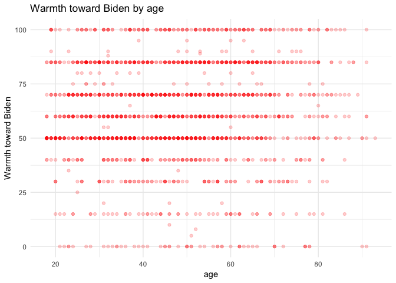

``` r
ggplot(df, aes(educ, biden)) +
  geom_point(alpha=0.2, color = "blue") +
  labs(x = "education years",
       y = "Warmth toward Biden",
       title = "Warmth toward Biden by education")
```

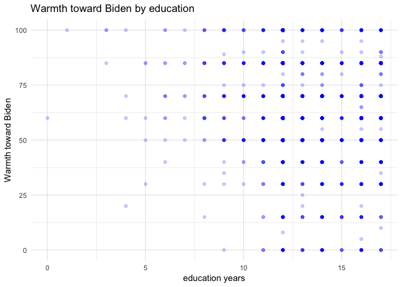

According to the bubble plot (x axis:Leverage; y axis:discrepancy; size: influence) for the unusual and/or influential observations for Biden themometer data (below), we can identify some observations with education years of 4, 9, 14,16, with large size of bubble, have large influence of an observation due to high discrepancy.

``` r
# add key statistics
df_augment <- df %>%
  mutate(hat = hatvalues(biden_mod),
         student = rstudent(biden_mod),
         cooksd = cooks.distance(biden_mod))

# draw bubble plot
ggplot(df_augment, aes(hat, student)) +
  geom_hline(yintercept = 0, linetype = 2) +
  geom_point(aes(size = cooksd), shape = 1) +
  geom_text(data = df_augment %>%
              arrange(-cooksd) %>%
              slice(1:10),
            aes(label = educ)) +
  scale_size_continuous(range = c(1, 20)) +
  labs(x = "Leverage",
       y = "Studentized residual",
       title = "Bubble Plot for unusual or/and influential observations") +
  theme(legend.position = "none")
```

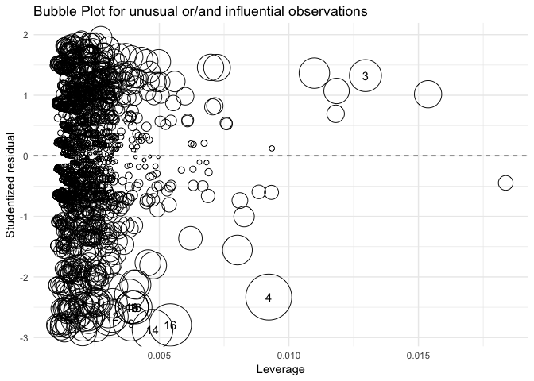

Also, based on the criteria of hat being larger than (k+1)/n, 74 "unusual" observations were obtained. With regard to the Studentized residues, 82 observations with discrepancy outside the range of 2 to -2 were selected out. Moreover, 90 "odd" observations with significant influence of the suggested model were also found.

``` r
df_augment %>%
  filter (hat > 2* mean (hat))
```

    ## # A tibble: 74 × 10
    ##    biden female   age  educ   dem   rep gender     hat student   cooksd
    ##    <int>  <int> <int> <int> <int> <int>  <chr>   <dbl>   <dbl>    <dbl>
    ## 1     70      0    80    17     0     0   male 0.00504   0.569 4.09e-04
    ## 2     70      1    44     7     1     0 female 0.00496  -0.019 4.49e-07
    ## 3    100      1    64     1     1     0 female 0.01537   1.018 4.04e-03
    ## 4    100      1    76     3     1     0 female 0.01184   1.071 3.44e-03
    ## 5     60      1    84    16     0     0 female 0.00446  -0.178 3.55e-05
    ## 6     60      1    63     4     0     0 female 0.00933  -0.603 8.56e-04
    ## 7     85      0    18     8     1     0   male 0.00600   0.985 1.46e-03
    ## 8     70      0    79     9     1     0   male 0.00461   0.263 8.00e-05
    ## 9     50      1    22     9     0     0 female 0.00450  -0.768 6.66e-04
    ## 10    50      1    23     8     0     0 female 0.00538  -0.808 8.83e-04
    ## # ... with 64 more rows

``` r
df_augment %>%
  filter(abs(student) > 2)
```

    ## # A tibble: 82 × 10
    ##    biden female   age  educ   dem   rep gender     hat student  cooksd
    ##    <int>  <int> <int> <int> <int> <int>  <chr>   <dbl>   <dbl>   <dbl>
    ## 1      0      1    70    12     0     1 female 0.00204   -2.91 0.00429
    ## 2      0      0    45    12     0     1   male 0.00142   -2.59 0.00237
    ## 3      0      0    40    14     0     0   male 0.00136   -2.50 0.00213
    ## 4     15      0    62     8     0     1   male 0.00411   -2.13 0.00466
    ## 5     15      1    20    13     0     0 female 0.00260   -2.12 0.00294
    ## 6      0      1    38    14     1     0 female 0.00122   -2.77 0.00233
    ## 7      0      0    34    12     0     0   male 0.00178   -2.57 0.00293
    ## 8      0      0    21    13     0     1   male 0.00259   -2.51 0.00407
    ## 9     15      1    29    12     0     1 female 0.00198   -2.18 0.00235
    ## 10     0      0    36    13     0     1   male 0.00149   -2.53 0.00239
    ## # ... with 72 more rows

``` r
df_augment %>%
  filter(cooksd > 4 / (nrow(.) - (length(coef(biden_mod)) - 1) - 1))
```

    ## # A tibble: 90 × 10
    ##    biden female   age  educ   dem   rep gender     hat student  cooksd
    ##    <int>  <int> <int> <int> <int> <int>  <chr>   <dbl>   <dbl>   <dbl>
    ## 1      0      1    70    12     0     1 female 0.00204   -2.91 0.00429
    ## 2      0      0    45    12     0     1   male 0.00142   -2.59 0.00237
    ## 3     15      0    62     8     0     1   male 0.00411   -2.13 0.00466
    ## 4     15      1    20    13     0     0 female 0.00260   -2.12 0.00294
    ## 5    100      1    64     1     1     0 female 0.01537    1.02 0.00404
    ## 6    100      0    19    12     0     0   male 0.00304    1.78 0.00242
    ## 7    100      0    19    12     1     0   male 0.00304    1.78 0.00242
    ## 8      0      1    38    14     1     0 female 0.00122   -2.77 0.00233
    ## 9    100      1    76     3     1     0 female 0.01184    1.07 0.00344
    ## 10     0      0    34    12     0     0   male 0.00178   -2.57 0.00293
    ## # ... with 80 more rows

First, it appears for those odd observations there is no obvious pattern in particular varaibles. Therefore, I guess those odd observations are merely outliers for the model we test, and it is not necessay to respecify the model itself. To examine this hypothesis, the common outliers based upon the above three criterion were removed.

``` r
#filter out the unusual data
df_omit<-df_augment %>%
  filter (hat < 2* mean (hat)) %>%
  filter(abs(student) < 2)%>%
  filter (cooksd < 4 / (nrow(.) - (length(coef(biden_mod)) - 1) - 1))

biden_omit_mod <- lm(biden ~ age + gender + educ, data = df_omit)

pander(tidy(biden_omit_mod))
```

<table style="width:78%;">
<colgroup>
<col width="16%" />
<col width="15%" />
<col width="16%" />
<col width="16%" />
<col width="12%" />
</colgroup>
<thead>
<tr class="header">
<th align="center">term</th>
<th align="center">estimate</th>
<th align="center">std.error</th>
<th align="center">statistic</th>
<th align="center">p.value</th>
</tr>
</thead>
<tbody>
<tr class="odd">
<td align="center">(Intercept)</td>
<td align="center">70.79</td>
<td align="center">3.562</td>
<td align="center">19.87</td>
<td align="center">6.438e-79</td>
</tr>
<tr class="even">
<td align="center">age</td>
<td align="center">0.08304</td>
<td align="center">0.03082</td>
<td align="center">2.694</td>
<td align="center">0.007125</td>
</tr>
<tr class="odd">
<td align="center">gendermale</td>
<td align="center">-5.867</td>
<td align="center">0.9853</td>
<td align="center">-5.954</td>
<td align="center">3.192e-09</td>
</tr>
<tr class="even">
<td align="center">educ</td>
<td align="center">-0.5383</td>
<td align="center">0.2297</td>
<td align="center">-2.343</td>
<td align="center">0.01924</td>
</tr>
</tbody>
</table>

``` r
multiplot(biden_mod,biden_omit_mod,names = c("All observations",
                              "Omit outliers")) +
  theme(legend.position = "bottom")
```

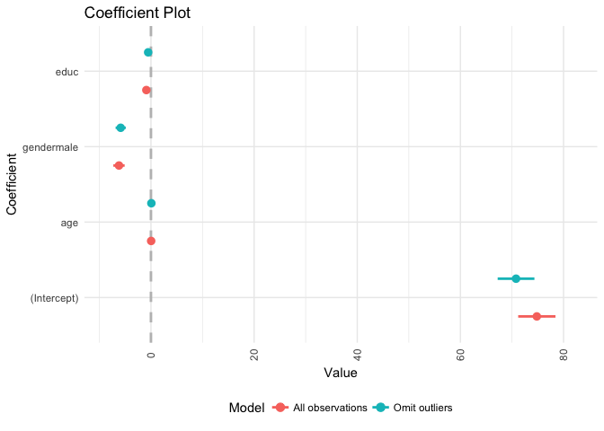

In the above coeffecient plot for the two data set, we can conclude there is not so much change from the original model:

-   The estimated coeffecient for age become a little bit bigger, while for gender and education, the coeffecients become a bit smaller.

-   There is no obvious change in the standard error for all the coefficients.

-   In the model by using the data without the outliers, there is a much stronger association between age and gender with the warmth toward Biden.

-   R square value is larger for the omitted observation model, and the RMSE is smaller (R square for the original observation model: 0.027; for the omited observation model: 0.03; RMSE for the original observation model: 23.134; for the omited observation model: 19.736

These omited observations mostly influenced the precision of the estimates, not the accuracy of them.

#### 2. Test for non-normally distributed errors. If they are not normally distributed, propose how to correct for them.

First, accrodign to the quantile-comparison plot (below), clearly,the observations with the quantile below -2 and above 2, fall outside the 95% coffidence intervals, indicating that these observations are not normally distributed.

``` r
car::qqPlot(biden_mod)
```

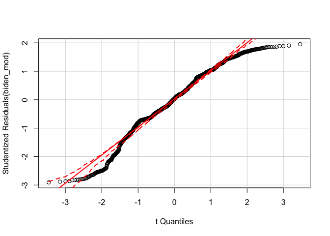

Secondly, from the density plot of the studentized residuals (below), we can also see that the residuals are dramaticaly skewed.

``` r
augment(biden_mod, df) %>%
  mutate(.student = rstudent(biden_mod)) %>%
  ggplot(aes(.student)) +
  geom_density(adjust = .5) +
  labs(x = "Studentized residuals",
       y = "Estimated density")
```


In order to fix the non-normally distributed errors, first, I tried the logistic transformation of the dependent variable, that is the warmth toward Biden. Then, I tested the normality of the residues of such logistic regressed model by quantile-comparison plot as follows. However, to transform the dependent vaariable does not help correct the non-normally distributed errors.

``` r
df2<-df %>%
  filter (biden != 0) %>%
  mutate (biden_log = log(biden))  

biden_log_mod <- lm( biden_log ~ age + gender + educ, data = df2)

pander(tidy(biden_log_mod)) 
```

<table style="width:78%;">
<colgroup>
<col width="16%" />
<col width="15%" />
<col width="16%" />
<col width="16%" />
<col width="12%" />
</colgroup>
<thead>
<tr class="header">
<th align="center">term</th>
<th align="center">estimate</th>
<th align="center">std.error</th>
<th align="center">statistic</th>
<th align="center">p.value</th>
</tr>
</thead>
<tbody>
<tr class="odd">
<td align="center">(Intercept)</td>
<td align="center">4.269</td>
<td align="center">0.06392</td>
<td align="center">66.79</td>
<td align="center">0</td>
</tr>
<tr class="even">
<td align="center">age</td>
<td align="center">0.0007372</td>
<td align="center">0.0005767</td>
<td align="center">1.278</td>
<td align="center">0.2013</td>
</tr>
<tr class="odd">
<td align="center">gendermale</td>
<td align="center">-0.08197</td>
<td align="center">0.01943</td>
<td align="center">-4.219</td>
<td align="center">2.584e-05</td>
</tr>
<tr class="even">
<td align="center">educ</td>
<td align="center">-0.01322</td>
<td align="center">0.003958</td>
<td align="center">-3.34</td>
<td align="center">0.0008568</td>
</tr>
</tbody>
</table>

``` r
car::qqPlot(biden_log_mod) 
```

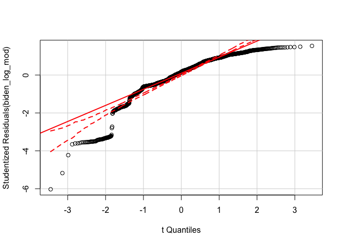

Therefore, according to Tukey and Mosteller's "Bulging Rule" for monotone transformations to linearity, I attempt to transform the age and education year to the polynorminal forms or logistic forms. By trail-and-error, I found the polinormial transformation can fix this problem a little bit. In the following two plots, we could see, under this model, more observations will fall in the 95% coffidence intervals and the denstiy plot of the studentized residue becomes a bit symmetric, although still not perfect.

``` r
df3<-df %>%
  mutate(educ_2 = educ^2) %>%
  mutate(educ_3 = educ^3) %>%
  mutate(educ_4 = educ^4) %>%
  mutate(age_2 = age^2) %>%
  mutate(age_3 = age^3) %>%
  mutate(age_4 = age^4)

biden_mod2 <- lm(biden ~  gender + age + age_2+ age_3 + age_4 + educ + educ_2 + educ_3 + educ_4, data = df3)

pander(tidy(biden_mod2)) 
```

<table style="width:78%;">
<colgroup>
<col width="16%" />
<col width="15%" />
<col width="16%" />
<col width="16%" />
<col width="12%" />
</colgroup>
<thead>
<tr class="header">
<th align="center">term</th>
<th align="center">estimate</th>
<th align="center">std.error</th>
<th align="center">statistic</th>
<th align="center">p.value</th>
</tr>
</thead>
<tbody>
<tr class="odd">
<td align="center">(Intercept)</td>
<td align="center">56.67</td>
<td align="center">30.68</td>
<td align="center">1.847</td>
<td align="center">0.0649</td>
</tr>
<tr class="even">
<td align="center">gendermale</td>
<td align="center">-6.327</td>
<td align="center">1.094</td>
<td align="center">-5.785</td>
<td align="center">8.531e-09</td>
</tr>
<tr class="odd">
<td align="center">age</td>
<td align="center">2.86</td>
<td align="center">2.265</td>
<td align="center">1.263</td>
<td align="center">0.2068</td>
</tr>
<tr class="even">
<td align="center">age_2</td>
<td align="center">-0.0947</td>
<td align="center">0.07239</td>
<td align="center">-1.308</td>
<td align="center">0.191</td>
</tr>
<tr class="odd">
<td align="center">age_3</td>
<td align="center">0.001319</td>
<td align="center">0.0009668</td>
<td align="center">1.365</td>
<td align="center">0.1726</td>
</tr>
<tr class="even">
<td align="center">age_4</td>
<td align="center">-6.509e-06</td>
<td align="center">4.587e-06</td>
<td align="center">-1.419</td>
<td align="center">0.1561</td>
</tr>
<tr class="odd">
<td align="center">educ</td>
<td align="center">-7.917</td>
<td align="center">8.683</td>
<td align="center">-0.9119</td>
<td align="center">0.362</td>
</tr>
<tr class="even">
<td align="center">educ_2</td>
<td align="center">1.773</td>
<td align="center">1.481</td>
<td align="center">1.197</td>
<td align="center">0.2315</td>
</tr>
<tr class="odd">
<td align="center">educ_3</td>
<td align="center">-0.1624</td>
<td align="center">0.1032</td>
<td align="center">-1.574</td>
<td align="center">0.1157</td>
</tr>
<tr class="even">
<td align="center">educ_4</td>
<td align="center">0.004775</td>
<td align="center">0.002516</td>
<td align="center">1.897</td>
<td align="center">0.05795</td>
</tr>
</tbody>
</table>

``` r
car::qqPlot(biden_mod2) 
```

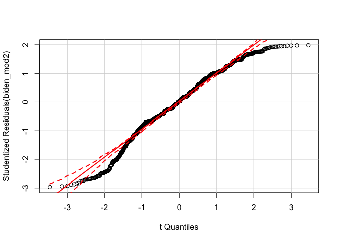

``` r
augment(biden_mod2, df) %>%
  mutate(.student = rstudent(biden_mod2)) %>%
  ggplot(aes(.student)) +
  geom_density(adjust = .5) +
  labs(x = "Studentized residuals for the polinomial model",
       y = "Estimated density for the polinomial model")
```

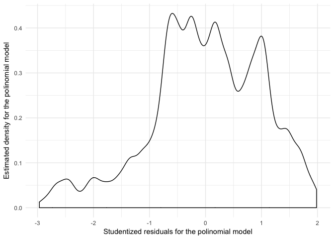

#### 3. Test for heteroscedasticity in the model. If present, explain what impact this could have on inference.

By the Breusch-Pagan test, the null hypothesis of homogeneous residues is rejected, indicating heteroscedasticity is present. The Heteroscedastic variance of error terms is also plotted as below.

-   the impact of heteroscedasticity: Although it is possible that our estimated parameters will not be unbiased, our estimates of the standard errors will be inaccurate - they will either be inflated or deflated, leading to incorrect inferences about the statistical significance of predictor variables.

Therefore, in the following section, I will try to solve this problem by weighting the errors of each predicate.

``` r
bptest(biden_mod)
```

    ## 
    ##  studentized Breusch-Pagan test
    ## 
    ## data:  biden_mod
    ## BP = 20, df = 3, p-value = 5e-05

``` r
df %>%
  add_predictions(biden_mod) %>%
  add_residuals(biden_mod) %>%
  ggplot(aes(pred, resid)) +
  geom_point(alpha = .2) +
  geom_hline(yintercept = 0, linetype = 2) +
  geom_quantile(method = "rqss", lambda = 5, quantiles = c(.05, .95)) +
  labs(title = "Heteroscedastic variance of error terms",
       x = "Predicted values",
       y = "Residuals")
```

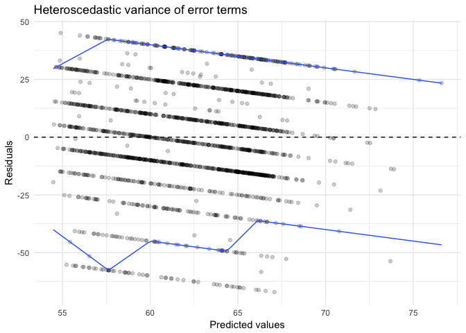

In order to accounting for heteroscedasticity,the weighted least squares regression is tried. By using this method, there are mild changes in the estimated parameters, when comparing the statistical summay tables below for the model before and after weighting. However, the drastic reductions in the standard errors could be found.

``` r
weights <- 1 / residuals(biden_mod)^2

biden_wls <- lm(biden ~ age+gender+educ, data = df, weights = weights)

pander(tidy(biden_mod))
```

<table style="width:78%;">
<colgroup>
<col width="16%" />
<col width="15%" />
<col width="16%" />
<col width="16%" />
<col width="12%" />
</colgroup>
<thead>
<tr class="header">
<th align="center">term</th>
<th align="center">estimate</th>
<th align="center">std.error</th>
<th align="center">statistic</th>
<th align="center">p.value</th>
</tr>
</thead>
<tbody>
<tr class="odd">
<td align="center">(Intercept)</td>
<td align="center">74.82</td>
<td align="center">3.614</td>
<td align="center">20.7</td>
<td align="center">1.338e-85</td>
</tr>
<tr class="even">
<td align="center">age</td>
<td align="center">0.04188</td>
<td align="center">0.03249</td>
<td align="center">1.289</td>
<td align="center">0.1975</td>
</tr>
<tr class="odd">
<td align="center">gendermale</td>
<td align="center">-6.196</td>
<td align="center">1.097</td>
<td align="center">-5.65</td>
<td align="center">1.864e-08</td>
</tr>
<tr class="even">
<td align="center">educ</td>
<td align="center">-0.8887</td>
<td align="center">0.2247</td>
<td align="center">-3.955</td>
<td align="center">7.941e-05</td>
</tr>
</tbody>
</table>

``` r
pander(tidy(biden_wls))
```

<table style="width:82%;">
<colgroup>
<col width="16%" />
<col width="15%" />
<col width="16%" />
<col width="16%" />
<col width="16%" />
</colgroup>
<thead>
<tr class="header">
<th align="center">term</th>
<th align="center">estimate</th>
<th align="center">std.error</th>
<th align="center">statistic</th>
<th align="center">p.value</th>
</tr>
</thead>
<tbody>
<tr class="odd">
<td align="center">(Intercept)</td>
<td align="center">74.99</td>
<td align="center">0.348</td>
<td align="center">215.5</td>
<td align="center">0</td>
</tr>
<tr class="even">
<td align="center">age</td>
<td align="center">0.03883</td>
<td align="center">0.00227</td>
<td align="center">17.11</td>
<td align="center">6.353e-61</td>
</tr>
<tr class="odd">
<td align="center">gendermale</td>
<td align="center">-5.97</td>
<td align="center">0.1288</td>
<td align="center">-46.37</td>
<td align="center">1.196e-309</td>
</tr>
<tr class="even">
<td align="center">educ</td>
<td align="center">-0.9098</td>
<td align="center">0.02879</td>
<td align="center">-31.6</td>
<td align="center">9.449e-175</td>
</tr>
</tbody>
</table>

Alternatively, I have also tried the procedure of Huber-White standard errors to correct for the variance-covariance estimates, which only adjusts the standard errors to account for the violation of the constant error variance assumption:

``` r
hw_std_err <- hccm(biden_mod, type = "hc1") %>%
  diag %>%
  sqrt

x<-tidy(biden_mod) %>%
  mutate(std.error.rob = hw_std_err)

pander(x)
```

<table style="width:100%;">
<colgroup>
<col width="16%" />
<col width="15%" />
<col width="16%" />
<col width="16%" />
<col width="13%" />
<col width="20%" />
</colgroup>
<thead>
<tr class="header">
<th align="center">term</th>
<th align="center">estimate</th>
<th align="center">std.error</th>
<th align="center">statistic</th>
<th align="center">p.value</th>
<th align="center">std.error.rob</th>
</tr>
</thead>
<tbody>
<tr class="odd">
<td align="center">(Intercept)</td>
<td align="center">74.82</td>
<td align="center">3.614</td>
<td align="center">20.7</td>
<td align="center">1.338e-85</td>
<td align="center">3.607</td>
</tr>
<tr class="even">
<td align="center">age</td>
<td align="center">0.04188</td>
<td align="center">0.03249</td>
<td align="center">1.289</td>
<td align="center">0.1975</td>
<td align="center">0.03328</td>
</tr>
<tr class="odd">
<td align="center">gendermale</td>
<td align="center">-6.196</td>
<td align="center">1.097</td>
<td align="center">-5.65</td>
<td align="center">1.864e-08</td>
<td align="center">1.106</td>
</tr>
<tr class="even">
<td align="center">educ</td>
<td align="center">-0.8887</td>
<td align="center">0.2247</td>
<td align="center">-3.955</td>
<td align="center">7.941e-05</td>
<td align="center">0.2226</td>
</tr>
</tbody>
</table>

#### 4. Test for multicollinearity. If present, propose if/how to solve the problem.

First, in the following partial residue plot, it is obvious that the relation between the reponse variable with the age is relatively linear, but with the education year is not. we can correct this by using the polinormial forms of education years as in the question 3 above.

``` r
# get partial resids
biden_resid <- residuals(biden_mod, type = "partial") %>%
  as_tibble
names(biden_resid) <- str_c(names(biden_resid), "_resid")

biden_diag <- augment(biden_mod, df) %>%
  bind_cols(biden_resid)

ggplot(biden_diag, aes(age, age_resid)) +
  geom_point(alpha = .1) +
  geom_smooth(se = FALSE) +
  geom_smooth(method = "lm", se = FALSE, linetype = 2) +
  labs(x = "Age",
       y = "Partial residual for age")
```

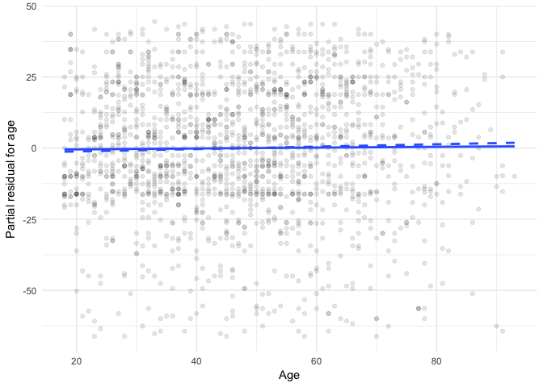

``` r
ggplot(biden_diag, aes(educ, educ_resid)) +
  geom_point(alpha = .1) +
  geom_smooth(se = FALSE) +
  geom_smooth(method = "lm", se = FALSE, linetype = 2) +
  labs(x = "Education",
       y = "Partial residual for education")
```

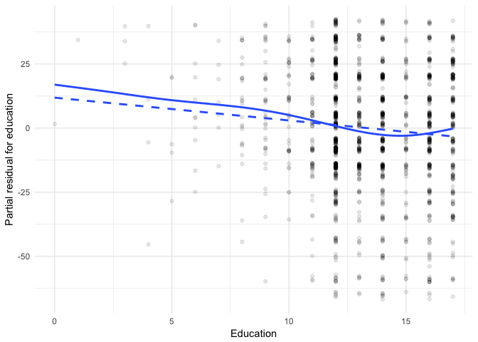

After the correction by polynomial transformation, the problem in the partial linerality has been solved.

``` r
biden_poly<-lm (biden ~ gender + educ + I(educ^2)+ I(educ^3) + I(educ^4) + age, data =df)
pander(tidy(biden_poly))
```

<table style="width:78%;">
<colgroup>
<col width="16%" />
<col width="15%" />
<col width="16%" />
<col width="16%" />
<col width="12%" />
</colgroup>
<thead>
<tr class="header">
<th align="center">term</th>
<th align="center">estimate</th>
<th align="center">std.error</th>
<th align="center">statistic</th>
<th align="center">p.value</th>
</tr>
</thead>
<tbody>
<tr class="odd">
<td align="center">(Intercept)</td>
<td align="center">86.6</td>
<td align="center">18.11</td>
<td align="center">4.782</td>
<td align="center">1.881e-06</td>
</tr>
<tr class="even">
<td align="center">gendermale</td>
<td align="center">-6.358</td>
<td align="center">1.093</td>
<td align="center">-5.816</td>
<td align="center">7.121e-09</td>
</tr>
<tr class="odd">
<td align="center">educ</td>
<td align="center">-8.068</td>
<td align="center">8.674</td>
<td align="center">-0.9302</td>
<td align="center">0.3524</td>
</tr>
<tr class="even">
<td align="center">I(educ^2)</td>
<td align="center">1.79</td>
<td align="center">1.479</td>
<td align="center">1.21</td>
<td align="center">0.2263</td>
</tr>
<tr class="odd">
<td align="center">I(educ^3)</td>
<td align="center">-0.1633</td>
<td align="center">0.103</td>
<td align="center">-1.585</td>
<td align="center">0.1132</td>
</tr>
<tr class="even">
<td align="center">I(educ^4)</td>
<td align="center">0.004793</td>
<td align="center">0.002512</td>
<td align="center">1.908</td>
<td align="center">0.05658</td>
</tr>
<tr class="odd">
<td align="center">age</td>
<td align="center">0.02466</td>
<td align="center">0.03286</td>
<td align="center">0.7504</td>
<td align="center">0.4531</td>
</tr>
</tbody>
</table>

``` r
biden_poly_resid <- residuals(biden_poly, type = "partial") %>%
  as_tibble

names(biden_poly_resid) <- c("gender", "educ", "educ_2", "educ_3", "educ_4", "age")
names(biden_poly_resid) <- str_c(names(biden_poly_resid), "_resid")

biden_poly_diag <- augment(biden_poly, df) %>%
  as_tibble %>%
  mutate(educ_resid = coef(biden_poly)[[3]] * educ + coef(biden_poly)[[4]] * educ^2 + coef(biden_poly)[[5]] * educ^3 + coef(biden_poly)[[6]] * educ)


ggplot(biden_poly_diag, aes(educ, educ_resid + .resid)) +
  geom_point(alpha = .1) +
  geom_smooth(aes(y = educ_resid), se = FALSE) +
  geom_smooth(se = FALSE, linetype = 2) +
  labs(x = "Education",
       y = "Partial residual for educ")       
```

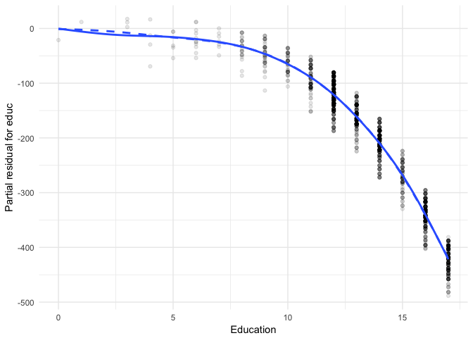

Second, in order to detect the multicollinearity, I tried two correlation test below for all the explantory variables in this data set, and I did not find any evidence that there exists the multicollinearity within age, educ and gender.

``` r
cormat_heatmap <- function(data){
  # generate correlation matrix
  cormat <- round(cor(data), 2)
  
  # melt into a tidy table
  get_upper_tri <- function(cormat){
    cormat[lower.tri(cormat)]<- NA
    return(cormat)
  }
  
  upper_tri <- get_upper_tri(cormat)
  
  # reorder matrix based on coefficient value
  reorder_cormat <- function(cormat){
    # Use correlation between variables as distance
    dd <- as.dist((1-cormat)/2)
    hc <- hclust(dd)
    cormat <-cormat[hc$order, hc$order]
  }
  
  cormat <- reorder_cormat(cormat)
  upper_tri <- get_upper_tri(cormat)
  
  # Melt the correlation matrix
  melted_cormat <- reshape2::melt(upper_tri, na.rm = TRUE)
  
  # Create a ggheatmap
  ggheatmap <- ggplot(melted_cormat, aes(Var2, Var1, fill = value))+
    geom_tile(color = "white")+
    scale_fill_gradient2(low = "blue", high = "red", mid = "white", 
                         midpoint = 0, limit = c(-1,1), space = "Lab", 
                         name="Pearson\nCorrelation") +
    theme_minimal()+ # minimal theme
    theme(axis.text.x = element_text(angle = 45, vjust = 1, 
                                     size = 12, hjust = 1))+
    coord_fixed()
  
  # add correlation values to graph
  ggheatmap + 
    geom_text(aes(Var2, Var1, label = value), color = "black", size = 4) +
    theme(
      axis.title.x = element_blank(),
      axis.title.y = element_blank(),
      panel.grid.major = element_blank(),
      panel.border = element_blank(),
      panel.background = element_blank(),
      axis.ticks = element_blank(),
      legend.position = "bottom")
}

cormat_heatmap(select_if(df, is.numeric))
```

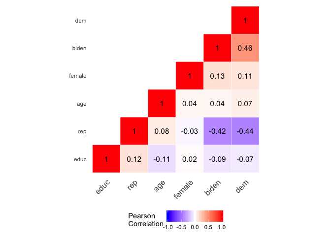

``` r
ggpairs(select_if(df, is.numeric))
```

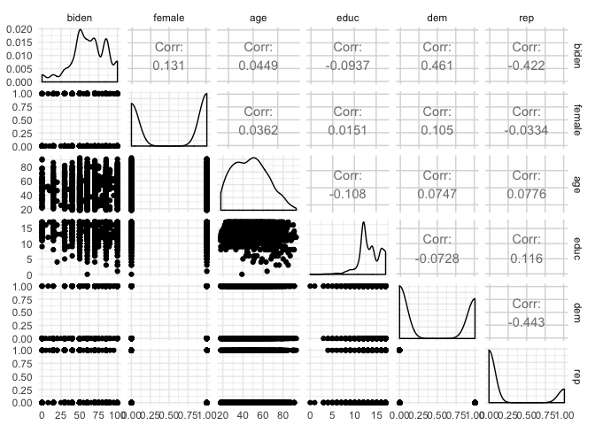

Also, by using Variance inflation factor (VIF), this point is corfirmed (when VIF is less than 10, indicating there is no strong multicollinearity)

``` r
pander(vif(lm(biden ~ age + gender + educ, data = df)))
```

<table style="width:29%;">
<colgroup>
<col width="8%" />
<col width="12%" />
<col width="8%" />
</colgroup>
<thead>
<tr class="header">
<th align="center">age</th>
<th align="center">gender</th>
<th align="center">educ</th>
</tr>
</thead>
<tbody>
<tr class="odd">
<td align="center">1.013</td>
<td align="center">1.002</td>
<td align="center">1.012</td>
</tr>
</tbody>
</table>

Interaction terms
-----------------

#### 1. Evaluate the marginal effect of age on Joe Biden thermometer rating, conditional on education. Consider the magnitude and direction of the marginal effect, as well as its statistical significance.

The fomular for the model in this task is expressed as:

*Biden Warmth* = *β*<sub>0</sub> + *β*<sub>1</sub>*Age* + *β*<sub>2</sub>*Education* + *β*<sub>3</sub>*Education* x *Age*

``` r
inter_mod<- lm (biden ~ age*educ, data = df)
pander(tidy(inter_mod))
```

<table style="width:78%;">
<colgroup>
<col width="16%" />
<col width="15%" />
<col width="16%" />
<col width="16%" />
<col width="12%" />
</colgroup>
<thead>
<tr class="header">
<th align="center">term</th>
<th align="center">estimate</th>
<th align="center">std.error</th>
<th align="center">statistic</th>
<th align="center">p.value</th>
</tr>
</thead>
<tbody>
<tr class="odd">
<td align="center">(Intercept)</td>
<td align="center">38.37</td>
<td align="center">9.564</td>
<td align="center">4.012</td>
<td align="center">6.254e-05</td>
</tr>
<tr class="even">
<td align="center">age</td>
<td align="center">0.6719</td>
<td align="center">0.1705</td>
<td align="center">3.941</td>
<td align="center">8.431e-05</td>
</tr>
<tr class="odd">
<td align="center">educ</td>
<td align="center">1.657</td>
<td align="center">0.714</td>
<td align="center">2.321</td>
<td align="center">0.02038</td>
</tr>
<tr class="even">
<td align="center">age:educ</td>
<td align="center">-0.04803</td>
<td align="center">0.0129</td>
<td align="center">-3.723</td>
<td align="center">0.0002029</td>
</tr>
</tbody>
</table>

``` r
pander(glance(inter_mod))
```

<table>
<caption>Table continues below</caption>
<colgroup>
<col width="15%" />
<col width="20%" />
<col width="10%" />
<col width="15%" />
<col width="12%" />
<col width="6%" />
<col width="11%" />
<col width="6%" />
</colgroup>
<thead>
<tr class="header">
<th align="center">r.squared</th>
<th align="center">adj.r.squared</th>
<th align="center">sigma</th>
<th align="center">statistic</th>
<th align="center">p.value</th>
<th align="center">df</th>
<th align="center">logLik</th>
<th align="center">AIC</th>
</tr>
</thead>
<tbody>
<tr class="odd">
<td align="center">0.01756</td>
<td align="center">0.01592</td>
<td align="center">23.27</td>
<td align="center">10.74</td>
<td align="center">5.368e-07</td>
<td align="center">4</td>
<td align="center">-8249</td>
<td align="center">16509</td>
</tr>
</tbody>
</table>

<table style="width:42%;">
<colgroup>
<col width="8%" />
<col width="15%" />
<col width="18%" />
</colgroup>
<thead>
<tr class="header">
<th align="center">BIC</th>
<th align="center">deviance</th>
<th align="center">df.residual</th>
</tr>
</thead>
<tbody>
<tr class="odd">
<td align="center">16536</td>
<td align="center">976688</td>
<td align="center">1803</td>
</tr>
</tbody>
</table>

The estimated parameter and standard error are reported in the first one of the above tables. Accodring to this table above, it is clear that there is strong association between the interaction term with the warmth toward Biden (*p*&lt;0.005). The other statistical data for this model with interaction term is summarized in the second table above.

``` r
# function to get point estimates and standard errors
# model - lm object
# mod_var - name of moderating variable in the interaction
instant_effect <- function(model, mod_var){
  # get interaction term name
  int.name <- names(model$coefficients)[[which(str_detect(names(model$coefficients), ":"))]]
  
  marg_var <- str_split(int.name, ":")[[1]][[which(str_split(int.name, ":")[[1]] != mod_var)]]
  
  # store coefficients and covariance matrix
  beta.hat <- coef(model)
  cov <- vcov(model)
  
  # possible set of values for mod_var
  if(class(model)[[1]] == "lm"){
    z <- seq(min(model$model[[mod_var]]), max(model$model[[mod_var]]))
  } else {
    z <- seq(min(model$data[[mod_var]]), max(model$data[[mod_var]]))
  }
  
  # calculate instantaneous effect
  dy.dx <- beta.hat[[marg_var]] + beta.hat[[int.name]] * z
  
  # calculate standard errors for instantaeous effect
  se.dy.dx <- sqrt(cov[marg_var, marg_var] +
                     z^2 * cov[int.name, int.name] +
                     2 * z * cov[marg_var, int.name])
  
  # combine into data frame
  data_frame(z = z,
             dy.dx = dy.dx,
             se = se.dy.dx)
}

# point range plot
instant_effect(inter_mod, "educ") %>%
  ggplot(aes(z, dy.dx,
             ymin = dy.dx - 1.96 * se,
             ymax = dy.dx + 1.96 * se)) +
  geom_pointrange() +
  geom_hline(yintercept = 0, linetype = 2) +
  labs(title = "Marginal effect of age",
       subtitle = "By education",
       x = "education (year)",
       y = "Estimated marginal effect")
```

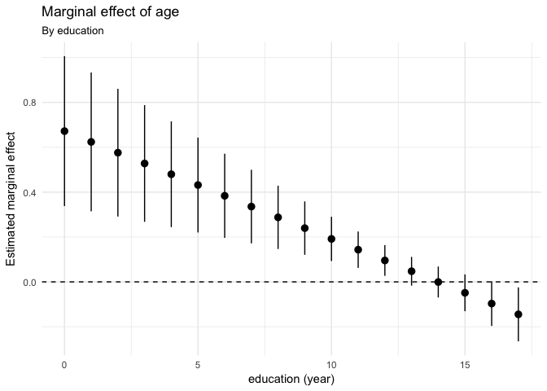

``` r
instant_effect(inter_mod, "educ") %>%
  ggplot(aes(z, dy.dx)) +
  geom_line() +
  geom_line(aes(y = dy.dx - 1.96 * se), linetype = 2) +
  geom_line(aes(y = dy.dx + 1.96 * se), linetype = 2) +
  geom_hline(yintercept = 0) +
  labs(title = "Marginal effect of age",
       subtitle = "By education",
       x = "education (year)",
       y = "Estimated marginal effect")
```

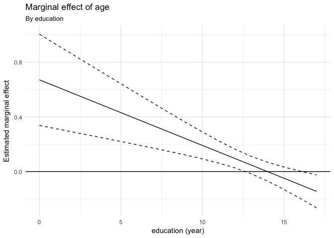

The marginal effect of age on the condition of educaiton years is presented in the above two plots. I will discuss this marginal effect from the aspects of magnitude, casual direction and statistical significance.

-   Magnitude and Causal direction: as the condition of education is fixed, then when the respondent with the minimal education year (0 year), the ψ<sub>1</sub> = 0.672-0.0048x0 = 0.672; when the respondent with the maximum education year (15 years), the the ψ<sub>2</sub> = 0.672-0.0048x15 = -0.048. This result indicates that as the education year increase, the marginal effect of age on the warmth toward Biden decreases: the difference between the elder and younger people in opinions about Biden are largest among those with little education, and smallest among those with higher education.

In addition, with regard to the standard error for the marginal effect of age, we can observe that: when educ=0, the standard error is the largest. as the education year incresaes, it become smaller until education year is around 12-13, then become a bit larger again at educ = 15.

-   statistical significance:

``` r
linearHypothesis(inter_mod, "age + age:educ")
```

    ## Linear hypothesis test
    ## 
    ## Hypothesis:
    ## age  + age:educ = 0
    ## 
    ## Model 1: restricted model
    ## Model 2: biden ~ age * educ
    ## 
    ##   Res.Df    RSS Df Sum of Sq    F Pr(>F)    
    ## 1   1804 985149                             
    ## 2   1803 976688  1      8461 15.6  8e-05 ***
    ## ---
    ## Signif. codes:  0 '***' 0.001 '**' 0.01 '*' 0.05 '.' 0.1 ' ' 1

According to the above hypothesis testing, it is obvious that the marginal effect of age is statistically significant.

#### 2. Evaluate the marginal effect of education on Joe Biden thermometer rating, conditional on age. Consider the magnitude and direction of the marginal effect, as well as its statistical significance.

The model used in this task is the same as above.The marginal effect of education conditional on age is presented in the two plots below:

``` r
# point range plot
instant_effect(inter_mod, "age") %>%
  ggplot(aes(z, dy.dx,
             ymin = dy.dx - 1.96 * se,
             ymax = dy.dx + 1.96 * se)) +
  geom_pointrange() +
  geom_hline(yintercept = 0, linetype = 2) +
  labs(title = "Marginal effect of education",
       subtitle = "By age",
       x = "age",
       y = "Estimated marginal effect")
```

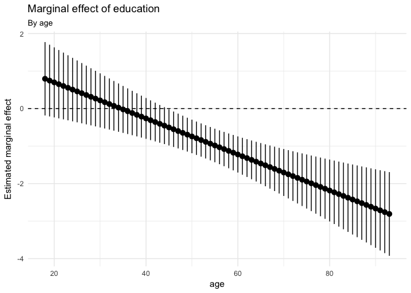

``` r
instant_effect(inter_mod, "age") %>%
  ggplot(aes(z, dy.dx)) +
  geom_line() +
  geom_line(aes(y = dy.dx - 1.96 * se), linetype = 2) +
  geom_line(aes(y = dy.dx + 1.96 * se), linetype = 2) +
  geom_hline(yintercept = 0) +
  labs(title = "Marginal effect of education",
       subtitle = "By age",
       x = "age",
       y = "Estimated marginal effect")
```

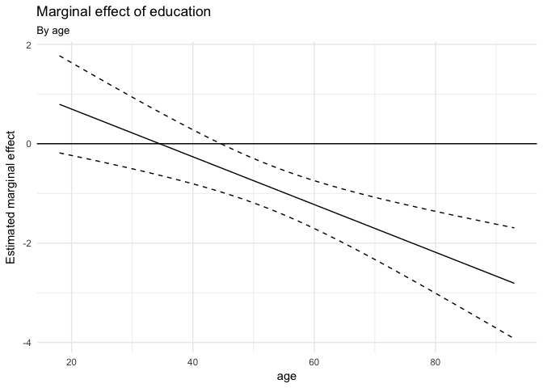

-   Magnitude and Causal direction: as the condition of age is fixed, then for the youngest respondent (18-year old), the ψ<sub>1&lt;&gt; = 1.657 -0.0048x0 = 1.657; for the eldest respondent (92-year old), the ψ<sub>2&lt;&gt; = 1.657-0.0048x92 = -2.759. This result indicates that as the age increases, the marginal effect of education on the warmth toward Biden decreases: the difference between the people with higher education and lower education in opinions about Biden are largest among the youngest people, and smallest among elder people.

In addition, with regard to the standard error for the marginal effect of education, we can observe that: the standard error for this marginal effect of education is always very huge across age, indicating that perhaps this effect is not so significant as that of age.

-   statistical significance:

``` r
linearHypothesis(inter_mod, "educ + age:educ")
```

    ## Linear hypothesis test
    ## 
    ## Hypothesis:
    ## educ  + age:educ = 0
    ## 
    ## Model 1: restricted model
    ## Model 2: biden ~ age * educ
    ## 
    ##   Res.Df    RSS Df Sum of Sq    F Pr(>F)  
    ## 1   1804 979537                           
    ## 2   1803 976688  1      2849 5.26  0.022 *
    ## ---
    ## Signif. codes:  0 '***' 0.001 '**' 0.01 '*' 0.05 '.' 0.1 ' ' 1

According to the above hypothesis testing, it is obvious that the marginal effect of education is only moderately significant.

With three continuous variables, we can start to consider three dimensional visualizations. For instance, we could represent this as a heatmap with contour lines:

``` r
df %>%
  data_grid(age, educ) %>%
  add_predictions(inter_mod) %>%
  ggplot(aes(age,educ, z = pred, fill = pred)) +
  geom_raster(interpolate = TRUE) +
  scale_fill_gradient2(midpoint = 50) +
  geom_contour() +
  labs(title = "Expected Biden thermometer score",
       x = "age",
       y = "education",
       fill = "Prediction")
```

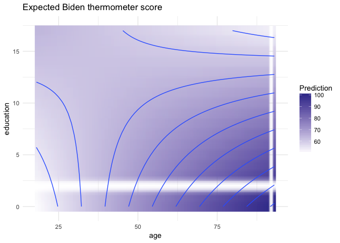

Missing data
------------

#### This time, use multiple imputation to account for the missingness in the data. Consider the multivariate normality assumption and transform any variables as you see fit for the imputation stage. Calculate appropriate estimates of the parameters and the standard errors and explain how the results differ from the original, non-imputed model.

First, in the 2323 observations in the original dataset, the missingness for each variable of interest are listed below.

``` r
# summarize the missing data
biden %>%
  select(biden, age, female, educ) %>%
  summarize_all(funs(sum(is.na(.)))) %>%
  pander()
```

<table style="width:40%;">
<colgroup>
<col width="11%" />
<col width="8%" />
<col width="12%" />
<col width="8%" />
</colgroup>
<thead>
<tr class="header">
<th align="center">biden</th>
<th align="center">age</th>
<th align="center">female</th>
<th align="center">educ</th>
</tr>
</thead>
<tbody>
<tr class="odd">
<td align="center">460</td>
<td align="center">46</td>
<td align="center">0</td>
<td align="center">11</td>
</tr>
</tbody>
</table>

According to the dicussion in problem 1, when the polinomial forms of education was introduced into the original model, the problem of multivariate normality will be fixed to certain sense. Therefore, in the following sections, I will deploy this model as a reference.

Below is the originial model in which the missing data has been listwisely deleted.

``` r
mod_poly <- lm(biden ~ female + age + educ + I(educ^2) + I(educ^3), data = df)
pander(tidy(mod_poly))
```

<table style="width:78%;">
<colgroup>
<col width="16%" />
<col width="15%" />
<col width="16%" />
<col width="16%" />
<col width="12%" />
</colgroup>
<thead>
<tr class="header">
<th align="center">term</th>
<th align="center">estimate</th>
<th align="center">std.error</th>
<th align="center">statistic</th>
<th align="center">p.value</th>
</tr>
</thead>
<tbody>
<tr class="odd">
<td align="center">(Intercept)</td>
<td align="center">59.23</td>
<td align="center">14.37</td>
<td align="center">4.122</td>
<td align="center">3.932e-05</td>
</tr>
<tr class="even">
<td align="center">female</td>
<td align="center">6.321</td>
<td align="center">1.094</td>
<td align="center">5.778</td>
<td align="center">8.862e-09</td>
</tr>
<tr class="odd">
<td align="center">age</td>
<td align="center">0.02219</td>
<td align="center">0.03286</td>
<td align="center">0.6753</td>
<td align="center">0.4996</td>
</tr>
<tr class="even">
<td align="center">educ</td>
<td align="center">6.408</td>
<td align="center">4.205</td>
<td align="center">1.524</td>
<td align="center">0.1277</td>
</tr>
<tr class="odd">
<td align="center">I(educ^2)</td>
<td align="center">-0.9259</td>
<td align="center">0.4013</td>
<td align="center">-2.307</td>
<td align="center">0.02114</td>
</tr>
<tr class="even">
<td align="center">I(educ^3)</td>
<td align="center">0.03196</td>
<td align="center">0.01205</td>
<td align="center">2.652</td>
<td align="center">0.008062</td>
</tr>
</tbody>
</table>

Impute the data by `Amelia()` function. Then,each of those complete imputed data was plotted (Biden rating vs. age) as below.

``` r
# transform the original dataset to dataframe
b.out <- amelia(as.data.frame(biden), m=5)
```

    ## -- Imputation 1 --
    ## 
    ##   1  2  3  4  5
    ## 
    ## -- Imputation 2 --
    ## 
    ##   1  2  3  4  5  6
    ## 
    ## -- Imputation 3 --
    ## 
    ##   1  2  3  4  5  6
    ## 
    ## -- Imputation 4 --
    ## 
    ##   1  2  3  4  5  6
    ## 
    ## -- Imputation 5 --
    ## 
    ##   1  2  3  4  5

``` r
#The list of imputed data frames is stored in the imputations element
str(b.out$imputations, max.level = 2)
```

    ## List of 5
    ##  $ imp1:'data.frame':    2323 obs. of  6 variables:
    ##   ..$ biden : num [1:2323] 90 70 60 50 60 85 60 50 50 70 ...
    ##   ..$ female: int [1:2323] 0 1 0 1 1 1 1 0 1 0 ...
    ##   ..$ age   : num [1:2323] 19 51 27 43 38 27 28 31 32 51 ...
    ##   ..$ educ  : num [1:2323] 12 14 14 14 14 16 12 15 13 14 ...
    ##   ..$ dem   : num [1:2323] 1 1 0 1 0 1 0 1 0 1 ...
    ##   ..$ rep   : num [1:2323] 0 0 0 0 1 0 0 0 0 0 ...
    ##   ..- attr(*, "spec")=List of 2
    ##   .. ..- attr(*, "class")= chr "col_spec"
    ##  $ imp2:'data.frame':    2323 obs. of  6 variables:
    ##   ..$ biden : num [1:2323] 90 70 60 50 60 85 60 50 50 70 ...
    ##   ..$ female: int [1:2323] 0 1 0 1 1 1 1 0 1 0 ...
    ##   ..$ age   : num [1:2323] 19 51 27 43 38 27 28 31 32 51 ...
    ##   ..$ educ  : num [1:2323] 12 14 14 14 14 16 12 15 13 14 ...
    ##   ..$ dem   : num [1:2323] 1 1 0 1 0 1 0 1 0 1 ...
    ##   ..$ rep   : num [1:2323] 0 0 0 0 1 0 0 0 0 0 ...
    ##   ..- attr(*, "spec")=List of 2
    ##   .. ..- attr(*, "class")= chr "col_spec"
    ##  $ imp3:'data.frame':    2323 obs. of  6 variables:
    ##   ..$ biden : num [1:2323] 90 70 60 50 60 85 60 50 50 70 ...
    ##   ..$ female: int [1:2323] 0 1 0 1 1 1 1 0 1 0 ...
    ##   ..$ age   : num [1:2323] 19 51 27 43 38 27 28 31 32 51 ...
    ##   ..$ educ  : num [1:2323] 12 14 14 14 14 16 12 15 13 14 ...
    ##   ..$ dem   : num [1:2323] 1 1 0 1 0 1 0 1 0 1 ...
    ##   ..$ rep   : num [1:2323] 0 0 0 0 1 0 0 0 0 0 ...
    ##   ..- attr(*, "spec")=List of 2
    ##   .. ..- attr(*, "class")= chr "col_spec"
    ##  $ imp4:'data.frame':    2323 obs. of  6 variables:
    ##   ..$ biden : num [1:2323] 90 70 60 50 60 85 60 50 50 70 ...
    ##   ..$ female: int [1:2323] 0 1 0 1 1 1 1 0 1 0 ...
    ##   ..$ age   : num [1:2323] 19 51 27 43 38 27 28 31 32 51 ...
    ##   ..$ educ  : num [1:2323] 12 14 14 14 14 16 12 15 13 14 ...
    ##   ..$ dem   : num [1:2323] 1 1 0 1 0 1 0 1 0 1 ...
    ##   ..$ rep   : num [1:2323] 0 0 0 0 1 0 0 0 0 0 ...
    ##   ..- attr(*, "spec")=List of 2
    ##   .. ..- attr(*, "class")= chr "col_spec"
    ##  $ imp5:'data.frame':    2323 obs. of  6 variables:
    ##   ..$ biden : num [1:2323] 90 70 60 50 60 85 60 50 50 70 ...
    ##   ..$ female: int [1:2323] 0 1 0 1 1 1 1 0 1 0 ...
    ##   ..$ age   : num [1:2323] 19 51 27 43 38 27 28 31 32 51 ...
    ##   ..$ educ  : num [1:2323] 12 14 14 14 14 16 12 15 13 14 ...
    ##   ..$ dem   : num [1:2323] 1 1 0 1 0 1 0 1 0 1 ...
    ##   ..$ rep   : num [1:2323] 0 0 0 0 1 0 0 0 0 0 ...
    ##   ..- attr(*, "spec")=List of 2
    ##   .. ..- attr(*, "class")= chr "col_spec"
    ##  - attr(*, "class")= chr [1:2] "mi" "list"

``` r
# plot each of the imputed complete dataframes
b.out$imputations %>%
  map(~ ggplot(.x, aes(biden, age)) +
  geom_point(alpha=0.2) +
  geom_smooth(se = FALSE) +
  labs(x = "age",
       y = "Warmth toward Biden"))
```

    ## $imp1

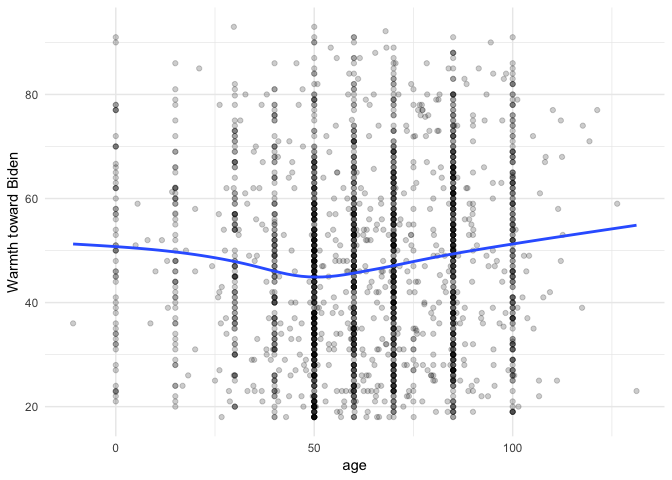

    ## 
    ## $imp2

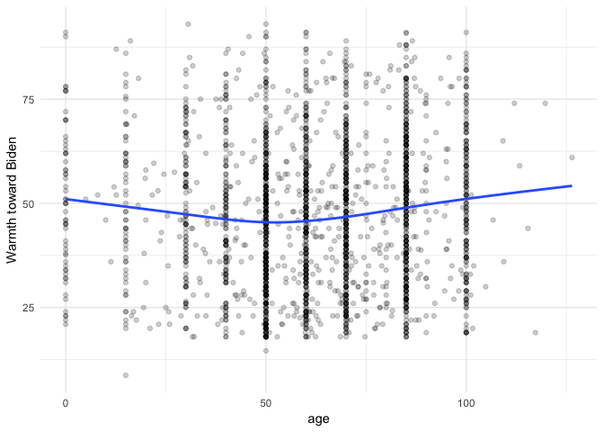

    ## 
    ## $imp3

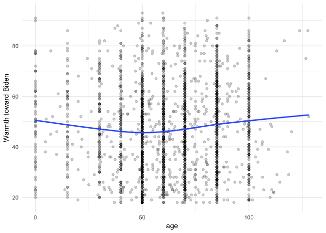

    ## 
    ## $imp4

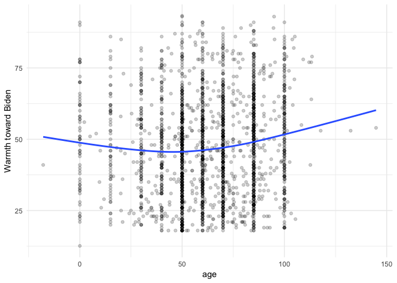

    ## 
    ## $imp5

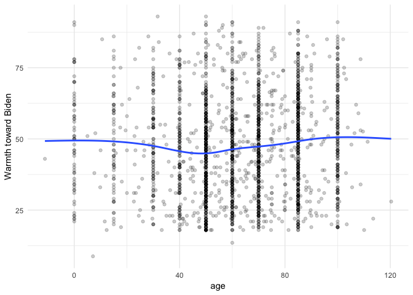

Then, I estimate the linear model from before on the new imputed datasets and extract the coeffecients and standard errors. To conduct inference, we need to average the estimates of the coefficients and the standard errors. `mi.meld()`. Here, we can observe some differences in the estimated parameters for the truncated dataset and the averaged imputed dataset.

``` r
models_imp <- data_frame(data = b.out$imputations) %>%
  mutate(model = map(data, ~ lm(biden ~ female + age + educ + I(educ^2) + I(educ^3),
                                data = .x)),
         coef = map(model, tidy)) %>%
  unnest(coef, .id = "id")

models_imp
```

    ## # A tibble: 30 × 6
    ##       id        term estimate std.error statistic  p.value
    ##    <chr>       <chr>    <dbl>     <dbl>     <dbl>    <dbl>
    ## 1   imp1 (Intercept)  63.9601   9.76424      6.55 7.04e-11
    ## 2   imp1      female   6.0017   0.96852      6.20 6.80e-10
    ## 3   imp1         age   0.0393   0.02825      1.39 1.64e-01
    ## 4   imp1        educ   3.1049   2.96864      1.05 2.96e-01
    ## 5   imp1   I(educ^2)  -0.5324   0.29397     -1.81 7.02e-02
    ## 6   imp1   I(educ^3)   0.0191   0.00906      2.11 3.54e-02
    ## 7   imp2 (Intercept)  47.7697   9.71569      4.92 9.42e-07
    ## 8   imp2      female   5.6731   0.96008      5.91 3.95e-09
    ## 9   imp2         age   0.0316   0.02797      1.13 2.58e-01
    ## 10  imp2        educ   6.5690   2.96736      2.21 2.69e-02
    ## # ... with 20 more rows

``` r
mi.meld.plus <- function(df_tidy){
  # transform data into appropriate matrix shape
  coef.out <- df_tidy %>%
    select(id:estimate) %>%
    spread(term, estimate) %>%
    select(-id)
  
  se.out <- df_tidy %>%
    select(id, term, std.error) %>%
    spread(term, std.error) %>%
    select(-id)
  
  combined.results <- mi.meld(q = coef.out, se = se.out)
  
  data_frame(term = colnames(combined.results$q.mi),
             estimate.mi = combined.results$q.mi[1, ],
             std.error.mi = combined.results$se.mi[1, ])
}


# compare results
summary_mod<-tidy(mod_poly) %>%
  left_join(mi.meld.plus(models_imp)) %>%
  select(-statistic, -p.value)

pander(summary_mod)
```

<table style="width:87%;">
<colgroup>
<col width="16%" />
<col width="15%" />
<col width="16%" />
<col width="19%" />
<col width="19%" />
</colgroup>
<thead>
<tr class="header">
<th align="center">term</th>
<th align="center">estimate</th>
<th align="center">std.error</th>
<th align="center">estimate.mi</th>
<th align="center">std.error.mi</th>
</tr>
</thead>
<tbody>
<tr class="odd">
<td align="center">(Intercept)</td>
<td align="center">59.23</td>
<td align="center">14.37</td>
<td align="center">54.77</td>
<td align="center">11.79</td>
</tr>
<tr class="even">
<td align="center">female</td>
<td align="center">6.321</td>
<td align="center">1.094</td>
<td align="center">5.557</td>
<td align="center">1.016</td>
</tr>
<tr class="odd">
<td align="center">age</td>
<td align="center">0.02219</td>
<td align="center">0.03286</td>
<td align="center">0.04192</td>
<td align="center">0.03364</td>
</tr>
<tr class="even">
<td align="center">educ</td>
<td align="center">6.408</td>
<td align="center">4.205</td>
<td align="center">5.283</td>
<td align="center">3.372</td>
</tr>
<tr class="odd">
<td align="center">I(educ^2)</td>
<td align="center">-0.9259</td>
<td align="center">0.4013</td>
<td align="center">-0.7022</td>
<td align="center">0.3201</td>
</tr>
<tr class="even">
<td align="center">I(educ^3)</td>
<td align="center">0.03196</td>
<td align="center">0.01205</td>
<td align="center">0.02337</td>
<td align="center">0.009643</td>
</tr>
</tbody>
</table>

Also, the missingness in the dataset is visualized in the heatmap. Furthermore, by using the `Amelia()`, we can direclty do the transformation of variable `educ` when processing the imputed models.Below, I also compare the averaged coeffecients and other parameters from this trasnformative imputed model with the original listwise deleted model.

``` r
# heatmap the missing data
missmap(b.out)
```

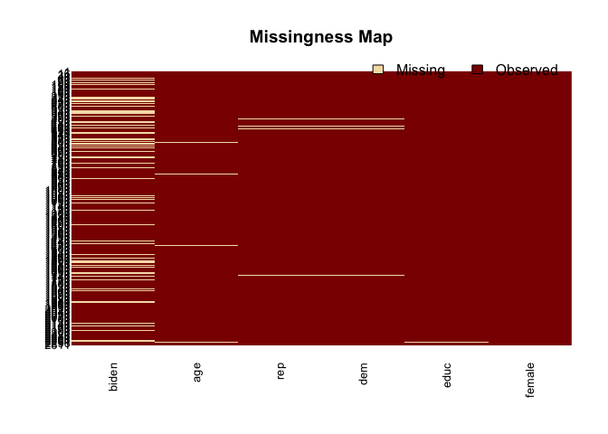

``` r
b_lite <- biden %>%
  select(biden, age, female, educ)

b_lite.out <- amelia(b_lite, m = 5,
                      sqrt = c("educ"), cube = c("educ"))
```

    ## -- Imputation 1 --
    ## 
    ##   1  2  3  4  5
    ## 
    ## -- Imputation 2 --
    ## 
    ##   1  2  3  4  5
    ## 
    ## -- Imputation 3 --
    ## 
    ##   1  2  3  4  5  6
    ## 
    ## -- Imputation 4 --
    ## 
    ##   1  2  3  4
    ## 
    ## -- Imputation 5 --
    ## 
    ##   1  2  3  4  5  6

``` r
models_trans_imp <- data_frame(data = b_lite.out$imputations) %>%
  mutate(model = map(data, ~ lm(biden ~ female + age + educ + I(educ^2) + I(educ^3),
                                data = .x)),
         coef = map(model, tidy)) %>%
  unnest(coef, .id = "id")

summary_mod2<-tidy(mod_poly) %>%
  left_join(mi.meld.plus(models_trans_imp)) %>%
  select(-statistic, -p.value)

pander(summary_mod2)
```

<table style="width:87%;">
<colgroup>
<col width="16%" />
<col width="15%" />
<col width="16%" />
<col width="19%" />
<col width="19%" />
</colgroup>
<thead>
<tr class="header">
<th align="center">term</th>
<th align="center">estimate</th>
<th align="center">std.error</th>
<th align="center">estimate.mi</th>
<th align="center">std.error.mi</th>
</tr>
</thead>
<tbody>
<tr class="odd">
<td align="center">(Intercept)</td>
<td align="center">59.23</td>
<td align="center">14.37</td>
<td align="center">63.5</td>
<td align="center">15.09</td>
</tr>
<tr class="even">
<td align="center">female</td>
<td align="center">6.321</td>
<td align="center">1.094</td>
<td align="center">5.998</td>
<td align="center">1.078</td>
</tr>
<tr class="odd">
<td align="center">age</td>
<td align="center">0.02219</td>
<td align="center">0.03286</td>
<td align="center">0.04408</td>
<td align="center">0.02909</td>
</tr>
<tr class="even">
<td align="center">educ</td>
<td align="center">6.408</td>
<td align="center">4.205</td>
<td align="center">3.474</td>
<td align="center">3.94</td>
</tr>
<tr class="odd">
<td align="center">I(educ^2)</td>
<td align="center">-0.9259</td>
<td align="center">0.4013</td>
<td align="center">-0.5905</td>
<td align="center">0.3526</td>
</tr>
<tr class="even">
<td align="center">I(educ^3)</td>
<td align="center">0.03196</td>
<td align="center">0.01205</td>
<td align="center">0.02123</td>
<td align="center">0.01025</td>
</tr>
</tbody>
</table>

``` r
# Compare the parameters in three models 
bind_rows(orig = tidy(mod_poly),
          full_imp = mi.meld.plus(models_imp) %>%
            rename(estimate = estimate.mi,
                   std.error = std.error.mi),
          trans_imp = mi.meld.plus(models_trans_imp) %>%
            rename(estimate = estimate.mi,
                   std.error = std.error.mi),
          .id = "method") %>%
  mutate(method = factor(method, levels = c("orig", "full_imp", "trans_imp"),
                         labels = c("Listwise deletion", "Full imputation",
                                    "Transformed imputation")),
         term = factor(term, levels = c("(Intercept)", "female",
                                        "age", "educ", "I(educ^2)", "I(educ^3)"),
                       labels = c("Intercept",  "gender(female=1)", "age", "educ", "educ^2", "educ^3"))) %>%
  ggplot(aes(fct_rev(term), estimate, color = fct_rev(method),
             ymin = estimate - 1.96 * std.error,
             ymax = estimate + 1.96 * std.error)) +
  geom_hline(yintercept = 0, linetype = 2) +
  geom_pointrange(position = position_dodge(.75)) +
  coord_flip() +
  scale_color_discrete(guide = guide_legend(reverse = TRUE)) +
  labs(title = "Comparing regression results",
       x = NULL,
       y = "Estimated parameter",
       color = NULL) +
  theme(legend.position = "bottom")
```

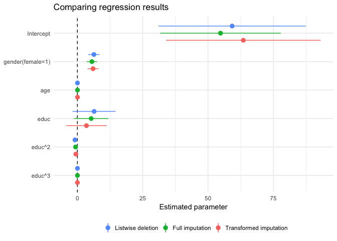

``` r
# Without the interception:

bind_rows(orig = tidy(mod_poly),
          full_imp = mi.meld.plus(models_imp) %>%
            rename(estimate = estimate.mi,
                   std.error = std.error.mi),
          trans_imp = mi.meld.plus(models_trans_imp) %>%
            rename(estimate = estimate.mi,
                   std.error = std.error.mi),
          .id = "method") %>%
  mutate(method = factor(method, levels = c("orig", "full_imp", "trans_imp"),
                         labels = c("Listwise deletion", "Full imputation",
                                    "Transformed imputation")),
         term = factor(term, levels = c("(Intercept)", "female",
                                        "age", "educ", "I(educ^2)", "I(educ^3)"),
                       labels = c("Intercept",  "gender(female=1)", "age", "educ", "educ^2", "educ^3"))) %>%
  filter(term != "Intercept") %>%
  ggplot(aes(fct_rev(term), estimate, color = fct_rev(method),
             ymin = estimate - 1.96 * std.error,
             ymax = estimate + 1.96 * std.error)) +
  geom_hline(yintercept = 0, linetype = 2) +
  geom_pointrange(position = position_dodge(.75)) +
  coord_flip() +
  scale_color_discrete(guide = guide_legend(reverse = TRUE)) +
  labs(title = "Comparing regression results",
       x = NULL,
       y = "Estimated parameter",
       color = NULL) +
  theme(legend.position = "bottom")
```

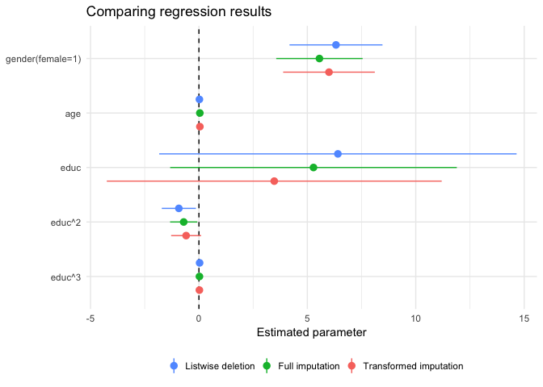

In conclusion, compared with the origninal model, the full and transformative imputed models do not have significant changes in their estimated co-effecients, although the co-effecients on educ: Likewise-deletion &gt; Full impution &gt; Transformed impution; co-effecients on gender: Likewise-deletion &gt; Transformed impution &gt; Full impution; co-effecients on educ^2: Transformed impution &gt; Full impution &gt; Likewise-deletion. However, the standard errors for almost all the explantory variables, especially educ and gender, are a little bit smaller in the imputed models than in the original models with listwisely deleted dataset. This result indicates that in our case, the imputed model can overcome the problem of missingness to certain extent, although the robustness of it is not more extraordinary than the original model.
